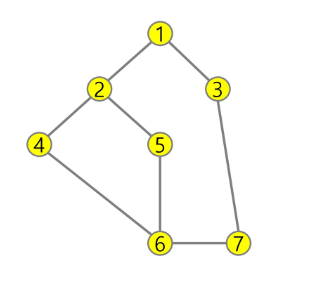

# BFS, DFS

## 그래프 표현

### 1. 인접 리스트
```python
[[], [2, 3], [1, 4, 5], [1, 7], [2, 6], [2, 6], [4, 5, 7], [3, 6]]
```
```python
N, M = map(int, input().split())
graph = [[]*(N+1)]
for _ in range(M):
    u, v = map(int, input().split())
    graph[u].append(v)
    graph[v].append(u)
```

### 2. 인접 행렬
```python
[
    [0, 0, 0, 0, 0, 0, 0, 0], 
    [0, 0, 1, 1, 0, 0, 0, 0], 
    [0, 1, 0, 0, 1, 1, 0, 0],
    [0, 1, 0, 0, 0, 0, 0, 1],
    [0, 0, 1, 0, 0, 0, 1, 0],
    [0, 0, 1, 0, 0, 0, 1, 0],
    [0, 0, 0, 0, 1, 1, 0, 1],
    [0, 0, 0, 1, 0, 0, 1, 0]
]
```
```python
N, M = map(int, input().split())
graph = [[0]*(N+1) for _ in range(N+1)]
for _ in range(M):
    u, v = map(int, input().split())
    graph[u][v] = 1
    graph[v][u] = 1
```

## BFS Breath First Search 너비 우선 탐색
* 다차원 배열에서 각 칸을 방문할 때 <u>**너비**</u>를 우선으로 방문하는 알고리즘


* queue를 사용하여 BFS 구현
* 파이썬에서는 deque으로 queue 구현
```python
from collections import deque

def BFS(now):
    queue = deque([now])
    visited[now] = True
    while queue:
        now = queue.popleft()
        for nxt in range(N+1):
            if not visited[nxt] and graph[now][nxt] == 1:
                visited[nxt] = True
                queue.append(nxt)
```
1. 탐색 시작 노드를 큐에 삽입, 해당 노드의 방문 기록
2. 큐에서 원소를 꺼내서, 해당 원소의 모든 인접 노드에 대해 조건 확인
3. 이전에 방문하지 않았다면, 큐에 삽입 방문 기록 후 2. 반복
4. 큐가 빌 때 까지 반복

### 시간 복잡도
* 인접 행렬 : O(N^2)
* 인접 리스트 : O(N+E)

### 문제 유형
* 최단경로
* 여러 정점에서 확산하는 문제
* Flood Fill
* 깊이를 구하는 문제

## DFS Depth First Search 깊이 우선 탐색
* 다차원 배열에서 각 칸을 방문할 때 <u>**깊이**</u>를 우선으로 방문하는 알고리즘


* stack을 사용하여 DFS 구현
```python
def DFS(now):
    stack = [now]
    while stack:
        now = stack.pop()
        if not visited[now]:
            visited[now] = True
            for nxt in range(N, -1, -1):
                if not visited[nxt] and graph[now][nxt] == 1:
                    stack.append(nxt)
```
1. 탐색할 노드를 스택에 삽입, 해당 노드의 방문 기록
2. 원소의 인접 노드에 대해 조건 확인
3. 이전에 방문하지 않았다면, 스택에 삽입 방문 기록 후 해당 원소에 대해 2. 반복
4. 모든 인접노드에 대해서 방문하였다면 stack에서 제거
5. stack이 빌 때 까지 반복

* 재귀를 사용하여 DFS 구현
```python
def DFS(now):
    visited[now] = 1
    for nxt in range(N+1):
        if not visited[nxt] and graph[now][nxt] == 1:
            DFS(nxt)
```

### 시간 복잡도
* 인접 행렬 : O(N^2)
* 인접 리스트 : O(N+E)

### 문제 유형
* 검색 대상 그래프가 큰 경우
* 각각의 경로를 저장해야하는 경우
* 경로의 개수를 구해야하는 경우